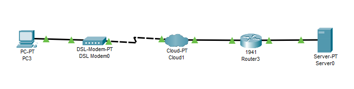

# Exercício 7
## Sobre o projeto:
Esse projeto tem como objetivo simular um ambiente onde uma conexão DSL foi utlizado para conectar a internet. 
## Exercício utilizado para a criação do projeto:
+ 1 DSL Moden
+ 1 Moden 1941
+ 1 Server 
+ Configure o host:
+ Endereço: 192.168.0.1
+ Máscara: 255.255.255.0
+ Gateway: 192.168.0.254
+ Configure a Cloud0:
+ DSL
+ Da porta com(From port) Modem4 para a
+ porta com(To port) GigaBitEthernet6
+ Configure o Router0:
+ Interface: GigabitEthernet0/0
+ Endereço: 192.168.0.254
+ Configure o Router0:
+ Interface GigabitEthernet0/1
+ Endereço: 172.16.0.254
+ Configure o Server0:
+ Endereço: 172.16.0.1
## Tecnologias utilizadas:
O projeto utiliza o Cisco Packet Tracer. 

## Principais funcionalidades:
Simular um ambiente onde uma conexão DSL foi estabelecida. \
!

